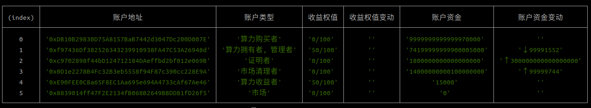

# 说明
   本文档描述用去中心化的形式实现算力使用权通证创建、添加到市场交易、购买使用权通证并获取算力资源及验证算力资源算力的过程。

# 业务场景
   描述分布式算力典型场景及流程

## 场景一: 用新GPU板卡（GTX_1050）创建使用权算力并在市场上销售
   - **算力提供者**创建GPU对应的Token，确定链上唯一ID：HID
   - 创建算力资源Token(包含UID的GPU板卡), 确定链上唯一ID：VID
   - 创建使用权通证（包含VID的算力资源）, UID
   - 将UID添加到算力市场进行销售（初次添加，需要确认收益者，并根据VID创建收益权通证RID）
   - **算力使用者**通过算力市场购买购买指定参数的算力，获取UID.
   - 使用UID获取算力资源使用权限（算力资源配置）
   - 对当前拥有使用权限的算力资源执行去中心化算力证明操作
   - 查看算力资源的证明结果及算力水平
   - **收益权持有者** 发起结账请求，获取当前收益

## 场景二： 重新发布使用权通证并在市场上销售
   - **算力提供者** 查询是否有当前处于自由状态的算力资源(自己账户下)，获取ID：VID
   - 如果有，创建新的使用权通证（使用查询的VID）,获取新的链上唯一ID：VID
   - 将UID添加到算力市场进行销售（不能创建新的收益权, 只能利用场景一中初次创建时的收益权通证RID）
   - **算力使用者**通过算力市场购买购买指定参数的算力，获取UID.
   - 使用UID获取算力资源使用权限（算力资源配置）
   - 对当前拥有使用权限的算力资源执行去中心化算力证明操作
   - 查看算力资源的证明结果及算力水平
   - **收益权持有者** 发起结账请求，获取当前收益

## **市场行为及收益权** 添加

---

# 主要内容说明

## 去中心化DAO组织建设
   目前未实现相应工具，后期实现
   角色说明：
      * 算力提供者：提供算力资源，创建算力使用权通证和收益权通证
      * 算力使用者：购买算力使用权通证从而获取算力资源使用权限
      * 收益权持有者：持有收益权持的账户获取算力使用权收益的分成权限
      * 收益权交易者：买卖收益权的账户

## DAO组织权限及任务
   * 完成合约部署及更新
   * 初始化市场支持的算力资源类型
   * 设置不同算力类型执行算力证明时对应的证明参数(难度)
   * 管理组织中用户及权限设置

   展示： 算力资源类型、 证明参数、类型收益权值列表

## 创建算力使用权通证过程(添加新算力资源)
   * 物理资源(GPU)在链上注册HID.(相当于生成一个GPU)
   * 利用物理资源在链上注册算力资源VID.(相当于创建包含指定GPU的虚拟环境vGPU)
   * 利用算力资源在链上注册使用权通证UID. (相当于云上的一个算力ID)
   
   展示：算力使用权通证信息
  
## 创建算力使用权通证过程(用已有算力资源)
    算力资源有效，并且没有被任何算力使用权通证绑定

   展示：算力使用权通证信息

## 算力使用权通证添加到市场（初次登录, 需要创建收益权）
    算力使用权所有者（算力资源拥有者）

   展示：算力市场

## 算力使用权通证添加到市场（用已有收益权）
    算力使用权绑定的算力资源已经在市场中注册了收益权，并有效

   展示：算力市场

## 购买算力使用权通证(获取算力资源使用权限)
    市场交易，影响资金池

   展示： 算力市场、用户持有算力使用权通证信息

## 算力证明（算力使用权所有者）
    执行算力证明，并将结果在链上存储
    影响算力报告和排行数据

   展示：算力排行信息

## 获取收益（收益所有者获取收益）
    根据持有收益比例获取收益

   展示：
   

